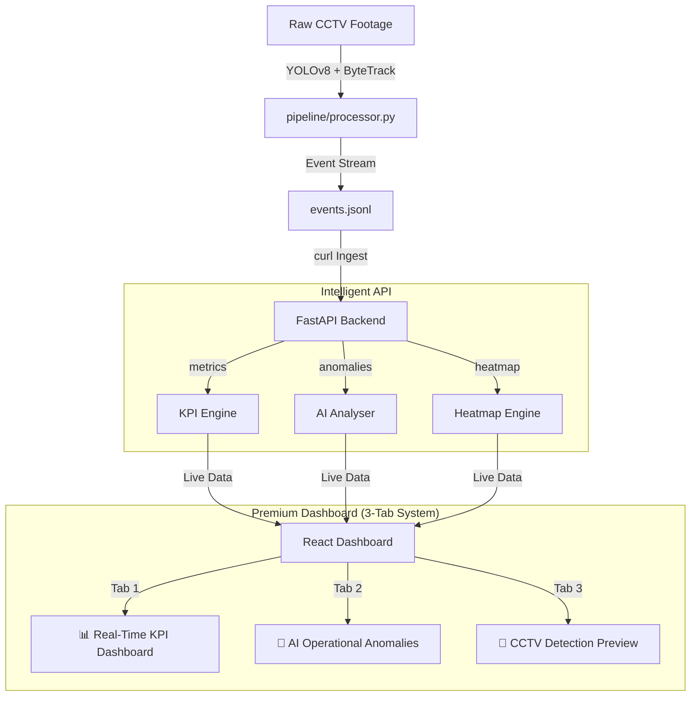

# Apex Store Intelligence 

End-to-end retail analytics: **CCTV footage → YOLOv8 detection → event stream → FastAPI → live React dashboard**.

## Architecture



## ✨ Premium Dashboard Features

1.  **AI Operational Anomalies (Important)**: Real-time detection of Queue Spikes, Conversion Drops, and Dead Zones with severity ratings (WARN/CRITICAL) and suggested operational actions.
2.  **System Health Widget**: Integrated STALE_FEED monitoring that alerts operators if the CCTV stream has disconnected or delayed.
3.  **Store Layout Heatmap**: A visual grid representing physical store zones (Skincare, Makeup, etc.) color-coded by traffic intensity.
4.  **CCTV Detection Preview**: A simulated view of what the YOLOv8n engine sees, showing bounding boxes, track IDs, and confidence scores.

## Quick Start — 5 Commands

```bash
# 1. Clone and install
pip install -r requirements.txt

# 2. Generate events (synthetic if no CCTV clips present)
python -m pipeline.run --synthetic --output events.jsonl

# 3. Seed the database and start the API
python scripts/seed_db.py && uvicorn backend.main:app --reload --port 8000

# 4. Start the dashboard  
cd frontend && npm install && npm run dev

# 5. (Optional) Live-stream demo — watch metrics update in real-time
python scripts/stream_events.py
```

- **API docs**: http://localhost:8000/docs  
- **Dashboard**: http://localhost:5173

## Docker (one command)

```bash
docker compose up --build
```

- API: http://localhost:8000/docs  
- Dashboard: http://localhost:5173

## Running the Detection Pipeline Against CCTV Clips

Place clips under `dataset/CCTV Footage/` matching the camera map in `config/camera_map.json`:

| File | Role |
|------|------|
| `CAM 1.mp4` | Entry/Exit |
| `CAM 2.mp4`, `CAM 3.mp4` | Main floor |
| `CAM 4.mp4`, `CAM 5.mp4` | Billing |

Then run:

```bash
# With real clips
python -m pipeline.run --dataset dataset --output events.jsonl

# Fast test (first 500 frames per camera)
python -m pipeline.run --dataset dataset --output events.jsonl --max-frames-per-cam 500

# Synthetic (no clips needed)
python -m pipeline.run --synthetic --output events.jsonl
```

Events are written to `events.jsonl`. Feed into the API:

```bash
curl -X POST http://localhost:8000/admin/reload-from-file?path=events.jsonl
```

Or live-stream (Part E demo):

```bash
python scripts/stream_events.py --batch-size 5 --interval 2
```

## API Endpoints

| Method | Path | Description |
|--------|------|-------------|
| `POST` | `/events/ingest` | Batch ingest (≤500 events), idempotent by `event_id` |
| `GET`  | `/stores/{id}/metrics` | Unique visitors, conversion rate, avg dwell per zone, queue depth |
| `GET`  | `/stores/{id}/funnel` | Entry→Zone→Billing→Purchase with drop-off % |
| `GET`  | `/stores/{id}/heatmap` | Zone visit frequency + avg dwell, normalised 0–100 |
| `GET`  | `/stores/{id}/spatial` | **Live customer positions** on floor plan with movement trails |
| `GET`  | `/stores/{id}/anomalies` | Queue spike, conversion drop, dead zone, abandonment |
| `GET`  | `/health` | Per-store STALE_FEED when last event > 10 min ago |
| `POST` | `/admin/reload-from-file` | Load `events.jsonl` into DB (demo) |
| `POST` | `/admin/clear-db` | Wipe DB for fresh live-stream demo |

Store ID aliases: `ST1008` ↔ `STORE_BLR_002` (both accepted everywhere).

## Event Schema

```json
{
  "event_id": "uuid-v4",
  "store_id": "STORE_BLR_002",
  "camera_id": "CAM_ENTRY_01",
  "visitor_id": "VIS_c8a2f1",
  "event_type": "ZONE_DWELL",
  "timestamp": "2026-03-03T14:22:10Z",
  "zone_id": "SKINCARE",
  "dwell_ms": 35000,
  "is_staff": false,
  "confidence": 0.91,
  "metadata": {
    "queue_depth": null,
    "sku_zone": "MOISTURISER",
    "session_seq": 5
  }
}
```

Supported event types: `ENTRY`, `EXIT`, `REENTRY`, `ZONE_ENTER`, `ZONE_EXIT`, `ZONE_DWELL`, `BILLING_QUEUE_JOIN`, `BILLING_QUEUE_ABANDON`.

## Live Dashboard Demo (Part E)

The dashboard polls all endpoints every 3 seconds in **Live Mode**. To watch metrics build up from zero in real time:

```bash
# Terminal 1 — start API
uvicorn backend.main:app --port 8000

# Terminal 2 — start dashboard
cd frontend && npm run dev

# Terminal 3 — stream events live (clears DB first, then streams)
python scripts/stream_events.py --batch-size 5 --interval 2.0
```

Open http://localhost:5173, enable **🔴 Live Mode**, watch visitors, conversion rate, zone heatmap, and anomalies update in real time.

### Spatial Analytics (customer movement on floor plan)

Open the **Spatial** tab on the dashboard. Customer dots move across the store layout as events stream in:

```bash
# Terminal 1 — API
uvicorn backend.main:app --port 8000

# Terminal 2 — Dashboard
cd frontend && npm run dev

# Terminal 3 — Stream events (customers move zone-to-zone on the map)
python scripts/stream_events.py --batch-size 3 --interval 1.5
```

Each `ZONE_ENTER` / `ZONE_DWELL` event carries `metadata.position_x/y` from YOLO bounding-box centroids. The `/stores/{id}/spatial` endpoint builds movement trails and active visitor positions.

## Tests

```bash
pytest tests/ -v
pytest tests/ --cov=backend --cov=pipeline --cov-report=term-missing
```

Covers: empty store, staff exclusion, duplicate idempotency, re-entry deduplication,  
zero conversion, purchase correlation, heatmap zone counts, queue spike anomaly,  
conversion drop anomaly, batch size limit, input validation, health endpoint, clear-db.

## Dataset Structure (read-only)

| Path | Contents |
|------|----------|
| `dataset/CCTV Footage/CAM *.mp4` | CCTV clips (entry, floor, billing) |
| `dataset/Brigade_*.csv` | POS transactions (order_id, timestamp, store_id, amount) |
| `dataset/Brigade Road - Store layout*.xlsx` | Zone names and layout |
| `config/store_layout.json` | Zone polygons + entry line (editable) |
| `config/camera_map.json` | CCTV filename → role + camera_id mapping |

**Never modify files under `dataset/`.**

## Edge Cases Handled

| Edge Case | How We Handle It |
|-----------|-----------------|
| Group entry | ByteTrack assigns separate `track_id` per person → 3 ENTRY events |
| Staff | Presence >15 min OR multi-zone → `is_staff=true`; excluded from metrics |
| Re-entry | HSV histogram + bbox match → REENTRY event reuses `visitor_id` (no double count) |
| Partial occlusion | Low-confidence detections still emitted (confidence passed through, not suppressed) |
| Queue abandonment | BILLING_QUEUE_ABANDON if visitor leaves billing zone before correlated POS |
| Empty periods | All metrics return 0 — API never returns null or crashes |
| Duplicate events | Idempotent by `event_id` — safe to ingest same payload twice |

See [DESIGN.md](DESIGN.md) and [CHOICES.md](CHOICES.md) for architecture and decision rationale.
